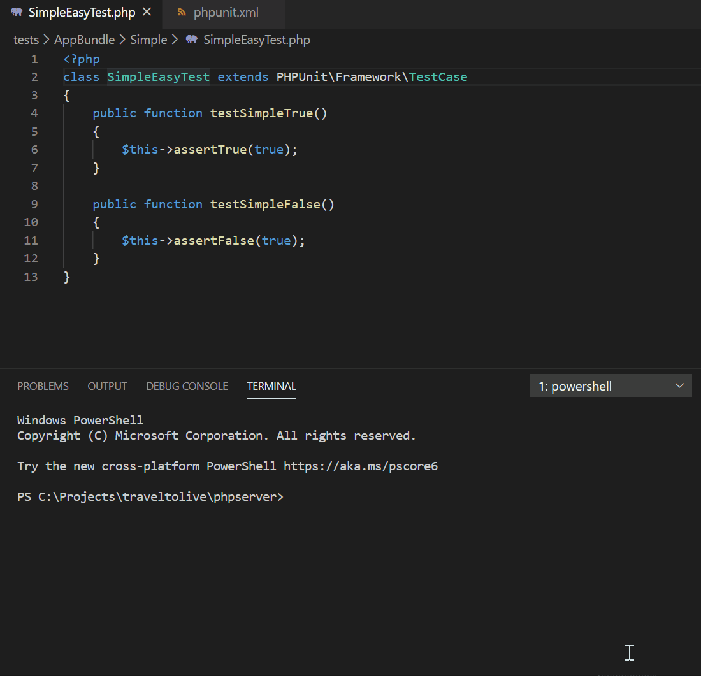
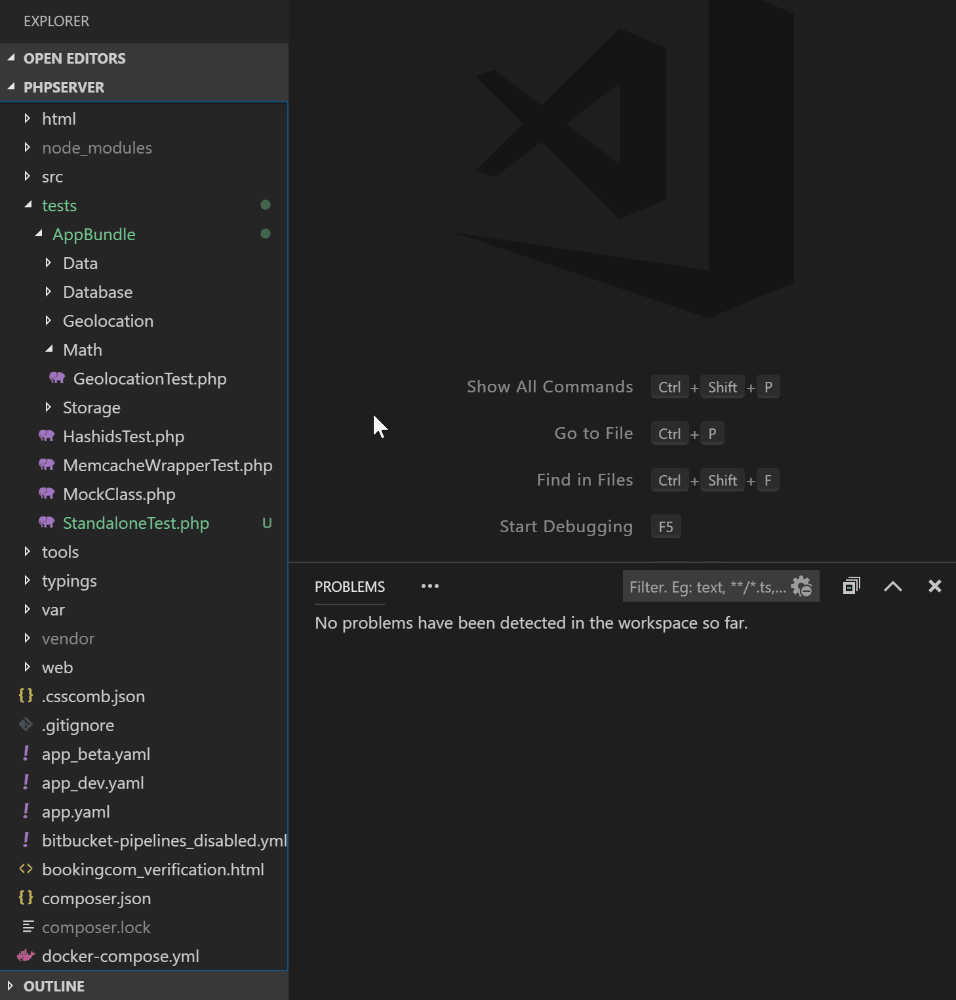

  
# PHPUnit for VSCode
This extension aims to need zero config and to be highly configurable. If you have `php` in environment path and `phpunit` installed with `composer` or anywhere in your workspace as `phpunit*.phar`, zero config is needed. It will even fallback to spinning up a self-removing `docker` container to try and run your tests if it can't find `php` on your machine.



## Features
  - Run tests with one **command** or **hotkey** based on **open file** (`*.php` or `phpunit.xml`) and **cursor position**
    - "quick pick" window is shown where more complicated selections are needed
  - Problems pane is populated with errors
  - Color output
  - Available commands:
    - PHPUnit Test
      - Tries to do the right thing (test `class/method` where cursor is or suite if file is `phpunit.xml`)
    - PHPUnit Test Nearest
    - PHPUnit Test Suite
    - PHPUnit Test Directory
    - PHPUnit Rerun Last Test
    - PHPUnit Stop Running Tests

## Manual setup
* Install [phpunit](https://phpunit.de/) in your workspace.
* Common config options:
```json5
{
    "phpunit.php": "path/to/php",           // Skip to use php in env path
    "phpunit.phpunit": "path/to/phpunit",   // Skip to find in common places (vendor, *.phar)
    "phpunit.args": [
        "-c", "./phpunit.xml.dist"          // Any args, check `phpunit --help`
    ],
    "phpunit.paths": {                      // Map paths in remote environments.
        "/local/path": "/remote/path",      // ${workspaceFolder} is replaced as in tasks.json
        "${workspaceFolder}": "/remote/app"
    }
}
```
> **Zero config needed** if you have **php** or **docker** in you environment path and **phpunit** in your project (composer vendor dir or *.phar file).
See the configuration section in [package.json](package.json) for all values and their descriptions (highly recommened if you need advanced functionality).

## Remote configs
For `docker`, `vagrant`, `laravel-homestead`, `WSL` or any other virtual/remote environment, **please consider the [Remote Development extension by Mircosoft](https://marketplace.visualstudio.com/items?itemName=ms-vscode-remote.vscode-remote-extensionpack)**. VSCode will run agains a remote directory and you can simply run your tests as you would locally.

### Manual ssh
```json5
{
    "phpunit.ssh": "ssh root@localhost \"<command>\"",  // ssh command to connect to remote machine.
    "phpunit.paths": {
        "/local/path": "/remote/path",
        "${workspaceFolder}": "/app"
    }
}
```
> `<command>` is populated by the extension. The final command could then be something like `ssh root@localhost "php ./phpunit.phar -c phpunit.xml"` depending on your settings.<br><br>
**Setup public/private keys** (passwords won't work):<br>  - Windows powershell `ssh-keygen && cat $env:userprofile/.ssh/id_rsa.pub | ssh root@localhost 'cat >> .ssh/authorized_keys'`<br>  - Linux bash `ssh-keygen && ssh-copy-id root@localhost`<br><br>
**OpenSSH** (`ssh` and `ssh-keygen`) is available on windows since late 2018. It's easy to [install](https://docs.microsoft.com/en-us/windows-server/administration/openssh/openssh_install_firstuse) with powershell if it's not enabled.

### Manual docker container
```json5
{
    "phpunit.docker.container": "container_name",   // Skip to select from running containers
    "phpunit.paths": {
        "${workspaceFolder}": "/app"                // Map your ${workspaceFolder} to where it
    }                                               // is in your container. Ex: /app
}
```

### Manual docker image
```json5
{
    "phpunit.command": "docker run --rm -t -v ${pwd}:/app -w /app php:latest php",
    "phpunit.paths": {                  // ${pwd} (current directory) is mounted to /app
        "${workspaceFolder}": "/app"    // ${workspaceFolder} is mapped to /app
    }
}
```
### Manual docker-compose service
```json5
{
    "phpunit.command": "docker-compose run --rm service_name",
    "phpunit.paths": {
        "${workspaceFolder}": "/app"                // Map your ${workspaceFolder} to where it
    }                                               // is in your container. Ex: /app
}
```

# Examples
Run with (`Cmd+Shift+P` on OSX or `Ctrl+Shift+P` on Windows and Linux) and execute the `PHPUnit Test` command.
* **Test a function**: Place cursor on a function and run.


* **Test a class**: Place cursor on class name and run.


* **Pick test from a list**: Place cursor anywhere in class except on class name or on a function and run.


* **Test everything according to --configuration**: Close editor window and run.


* **Test everything in a directory**: Open a file in the directory to test and run the `PHPUnit Test Directory` command.



* **Rerun last Test**: Run the `PHPUnit Rerun Last Test` command.

## Keybinding example:
```json5
{ "key": "cmd+shift+t", "command": "phpunit.Test", "when": "editorFocus" }
```